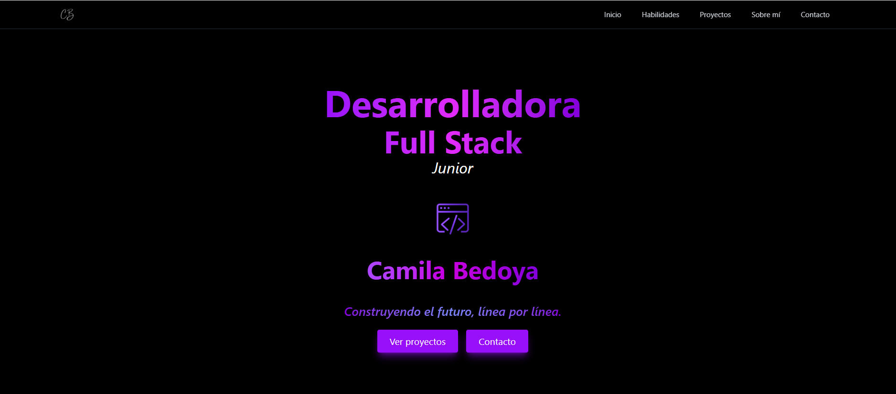
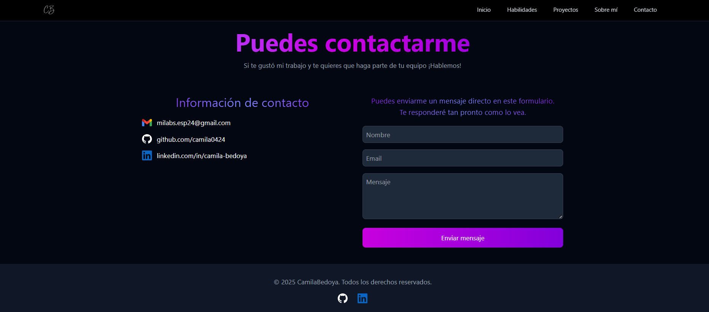

# Portafolio Web - Camila Bedoya

Bienvenido a mi portafolio como **Desarrolladora Full Stack Junior**, donde combino creatividad y funcionalidad para crear experiencias digitales memorables.  
Este proyecto está desarrollado con **React + Vite**, utilizando **Tailwind CSS** para un diseño responsive moderno.

---

## Demo

[Ver Portafolio en Vivo](https://portafolio-livid-six.vercel.app/)  
[Repositorio en GitHub](https://github.com/camila0424/portafolio.git)

---

## Tecnologías Principales

  
  
  

---

## Características

- ✅ Diseño totalmente responsive
- ✅ Efectos de hover y scroll suave
- ✅ Secciones animadas
- ✅ Formulario funcional (Formspree)
- ✅ Código modular y limpio

---

## Vista de contacto

---

### 📫 Conecta conmigo

- [LinkedIn](https://www.linkedin.com/in/camila-bedoya/)
- milabs.esp24@gmail.com
